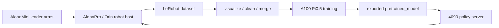

# Aloha Pi0.5 LeRobot

Engineering templates and adapters for running a LeRobot-based real-robot
pipeline on Aloha-style hardware:

- AlohaMini bimanual leader arms for teleoperation.
- AlohaPro / Orin robot host for camera, state, action, and safety loops.
- LeRobot-format dataset collection, cleaning, merging, visualization, and upload.
- Pi0.5 training on an A100 server.
- Remote Pi0.5 inference on an RTX 4090 server.
- Orin-to-4090 closed-loop control through a server-client bridge.

This repository is intentionally not a raw fork dump. It contains the reusable
project boundary: public docs, configuration templates, helper scripts, and
small Python modules that make the system understandable and reproducible
without publishing private paths, logs, datasets, model weights, or SSH details.

## Project Scope

This project extends the ideas and APIs of
[LeRobot](https://github.com/huggingface/lerobot) for a real Aloha deployment.
The core engineering contribution is the end-to-end system integration:



## Repository Layout

```text
configs/                  Example YAML configs with no private machine data.
docs/                     Architecture and operating guides.
examples/                 Fake/demo entry points that run without a robot.
scripts/                  Startup templates for Orin, A100, and 4090 machines.
src/aloha_lerobot/         Lightweight reusable Python helpers.
tests/                    Unit tests for action mapping and dataset tooling.
```

## What Is Not Included

The following files should be hosted elsewhere or kept private:

- Raw robot datasets and videos.
- Pi0.5 / ACT checkpoints and `.safetensors` files.
- `wandb` runs, training logs, caches, and temporary outputs.
- SSH configs, user names, private IPs, USB serial numbers, and machine paths.

Use Hugging Face Hub for shareable datasets and model checkpoints, and keep
this repository focused on code, configuration templates, and documentation.

## Quick Start

Install the lightweight helper package:

```bash
python -m pip install -e .
python -m pytest
```

Run the fake bridge demo:

```bash
python examples/fake_remote_inference_demo.py
```

For real hardware, start from:

- `docs/hardware_setup.md`
- `docs/data_collection.md`
- `docs/train_pi05_a100.md`
- `docs/remote_inference_4090_orin.md`
- `docs/safety.md`

## Relationship To LeRobot

This project is built on LeRobot concepts and is designed to be used together
with a LeRobot checkout. LeRobot is licensed under Apache-2.0. Files adapted
from LeRobot retain their copyright and license notices where applicable.

## Status

This repository is a cleaned public release scaffold for a working internal
deployment. The default scripts use placeholders and must be adapted to each
robot lab's hardware, network, dataset IDs, and checkpoint locations.
